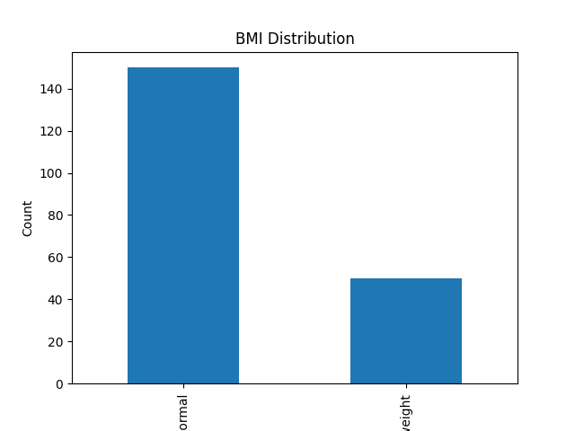

# BMI Data Analysis Project

This project analyzes BMI data using Python, Pandas, and Matplotlib.

## 📊 Features
- Reads CSV data
- Calculates BMI categories
- Generates summary statistics
- Creates visualization (bar chart)
- Saves output files

## 🛠 Technologies Used
- Python
- Pandas
- Matplotlib

## 📁 Project Structure
- data/ → input dataset
- output/ → generated results (chart + csv)
- main.py → main script

## ▶️ How to Run
1. Install dependencies:
   pip install pandas matplotlib

2. Run:
   python main.py

## 📈 Output
- BMI chart (PNG)
- Processed results (CSV)

## 📊 Sample Output

  
